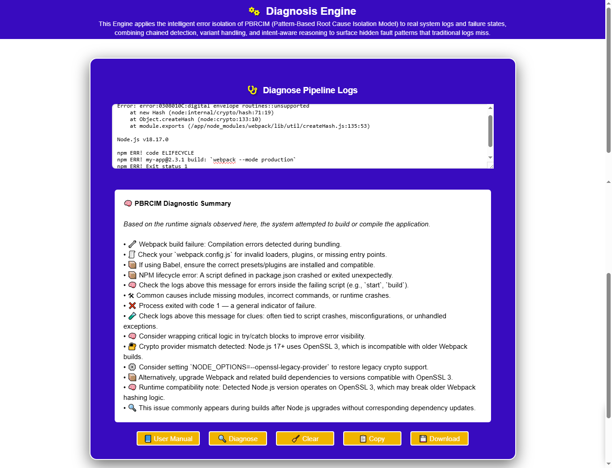

> A production-grade diagnostic intelligence system built around the PBRCIM model for high-signal failure analysis.

🧠 PBRCIM Diagnosis Engine (Public Interface)
Intelligent System Log Diagnosis & Failure Pattern Isolation
The PBRCIM Diagnosis Engine is a system-level diagnostic tool designed to analyze real-world execution logs and surface actionable, high-signal insights across build pipelines, runtime environments, CI/CD workflows, and application failures.
This repository documents the architecture, behavior, and outputs of the public-facing Diagnosis Engine - not its internal rule engine.

🚀 What the Engine Does
The Diagnosis Engine processes raw system logs (Node.js, Webpack, CI/CD, network, auth, runtime, and build outputs) and returns:
•	Failure-class identification
•	Root-cause inference based on execution intent
•	Context-aware remediation steps
•	Runtime compatibility notes (e.g. Node / OpenSSL / dependency drift)
•	Guarded escalation paths for restricted diagnostic domains
The system is powered by PBRCIM (Pattern-Based Root Cause Isolation Model) - a structured framework for tracing intent divergence between expected and actual execution behavior.

🧩 Example Output (Real Engine Result)
Below is an example of the Diagnosis Engine analyzing a Webpack build failure caused by a Node.js crypto provider mismatch:
🧠 PBRCIM Diagnostic Summary
This log indicates the system was attempting to build or compile the application, but encountered a failure.
• 🔐 Crypto provider mismatch detected: Node.js 17+ uses OpenSSL 3, which is incompatible with older Webpack builds.
• ⚙️ Consider setting NODE_OPTIONS=--openssl-legacy-provider to restore legacy crypto support.
• 📦 Alternatively, upgrade Webpack and related build dependencies to versions compatible with OpenSSL 3.
• 🧠 Runtime compatibility note: Detected Node.js version operates on OpenSSL 3, which may break older hashing logic.
📸 See screenshots below for full UI context.

🖥️ Interface Preview

The public engine is delivered via a clean, browser-based interface designed for fast diagnosis and clarity of output.
Screenshots include:
•	Raw log input
•	Structured diagnosis output
•	Actionable remediation guidance
•	Clear separation between analysis and escalation paths
(See /screenshots directory.)

🔐 About Source Availability
This repository does not expose the internal inference rules, pattern-matching logic, or diagnostic pipelines that power the engine.
Why?
•	The engine operates on real-world failure intelligence
•	Certain diagnostic domains require guarded handling
•	Advanced inference layers are provisioned privately
This separation is intentional and reflects production-grade system design, not a limitation.

🧠 Advanced Mode (Private)
A private Advanced Mode exists as an offline, environment-aligned build engineered for:
•	Deeper protocol and runtime inspection
•	Restricted or sensitive error domains
•	Enterprise CI/CD pipelines
•	Air-gapped or offline execution
Advanced Mode is provisioned on request and tailored to the target environment.

📬 Contact
For collaboration, system design discussions, or private Advanced Mode provisioning:
•	Email: contact@cursorlord.com
•	Website: https://cursorlord.com

This repository represents a system in operation - not a tutorial artifact.

